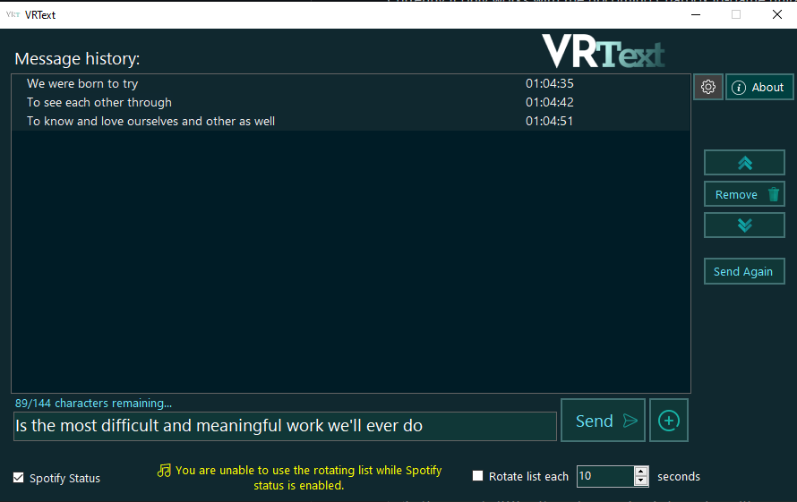
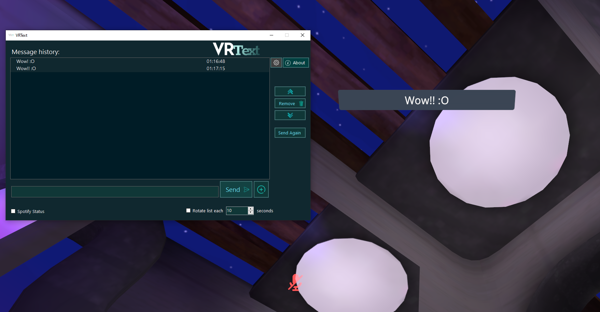

# VRText Alpha - Update 1.0.0.5
An OSC based chatbox tool for VRChat.

Currently it only works with the Chatbox in-game utilizing OSC endpoints specified by the VRChat team.

# Features - Share your message!

- Create a custom list of sentences that you want to share with your friends and as long as you keep the option enabled, your list will be rotating automatically until you stop it.
You can also define the rotating change time limit starting from 5 seconds all up to a lot :)
- You can share your current song from Spotify with changes in real time as soon as your song updates. *Only works with the desktop application, it doesn't work with the web player.

# How to use

- Inside the game make sure you have the OSC server enabled.

- Start VRText and try to send a message, if you look up you may see it popping up right above your head.

If it doesn't work right away keep the OSC enabled, restart the game and try again.

Now you can start sharing what you want to say or your music, be creative! :)

# SteamVR Autostart

If you wish for VRText to start automatically with your SteamVR it can be done as such here following the tutorial below
1. First download the SteamVrManifest located here [SteamVRManifest](VRtext/manifest.vrmanifest "SteamVRManifest")
2. Place this downloaded file into the same directory were you have places VRtext.exe
3. Start SteamVR and then double click the manifest to add it to your SteamVR install
4. Go to SteamVR > Settings > Startup / Shutdown. Toggle VRText to on if it isn't already

Tutorial below

https://user-images.githubusercontent.com/20288698/235174755-38c8c2a1-a537-4ce5-9c09-4cd0dcfeed0a.mp4

# Removal of AutoStart
Toggle the button off in Steamvr Startup / Shutdown or Remove the manifest file or relocate it and SteamVR will auto remove it

## If you want to collaborate with the project or even create a brand new idea by using its core feel free to do so.
