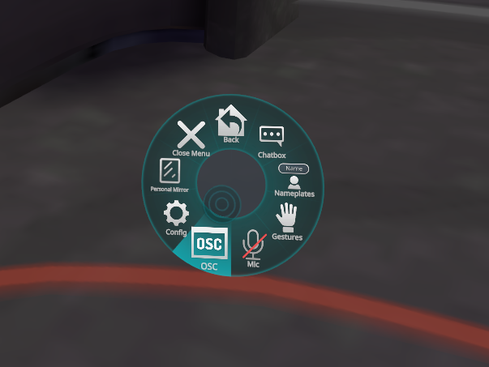
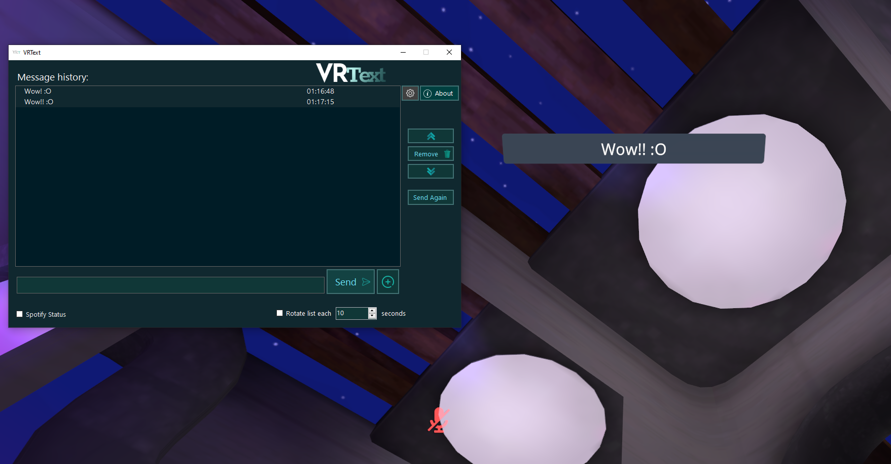

# VRText Alpha - Release Update 1.0.0.1
An OSC based messaging application for VRChat.

Currently it only works with the Chatbox in-game utilizing OSC endpoints specified by the VRChat team. New features will be implemented in the future.

I'm proud to announce that VRText's got its first release, the executable is already available for download.

# Features - Share your message!

- Create a custom list of sentences that you want to share with your friends and as long as you keep the option enabled, your list will be rotating automatically until you stop it.
You can also define the rotating change time limit starting from 5 seconds all up to a lot :)
- You can share your current song from Spotify with changes in real time as soon as your song updates. *Only works with the desktop application, it doesn't work with the web player.

# How to use

- Inside the game make sure you have the OSC server enabled.

- Start VRText and try to send a message, if you look up you may see it popping up right above your head.

If it doesn't work right away keep the OSC enabled, restart the game and try again.

Now you can start sharing what you want to say or your music, be creative! :)

## If you want to collaborate with the project or even create a brand new idea by using its core feel free to do so.
