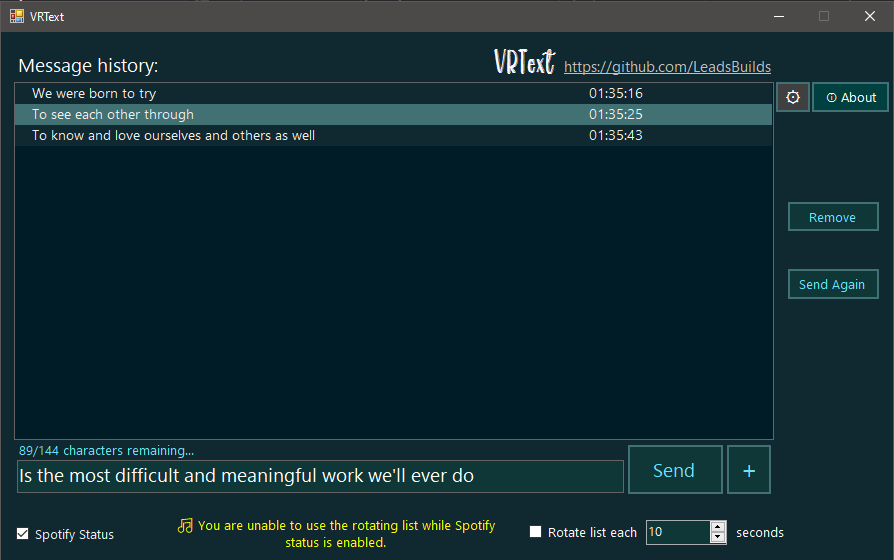

# VRText Alpha
An OSC based messaging system developed exclusively for VRChat players.

Currently it only works with the upcoming Chatbox in-game utilizing the endpoints specified by the VRChat team. I will improve it to support other applications in the near future!

This is an work in progress, I'll release more updates and even an executable soon.

.

# Features - Share your message!

- Create a custom list of sentences that you want to share with your friends and as long as you keep the option enabled, your list will be rotating automatically until you stop it.
You can also define the rotating change time limit starting from 10 seconds all up to a lot :)
- You can share your current song from Spotify with changes in real time as soon as your playlist plays or you skip the song.

## A lot more to share.

This is an work in progress, I'll release more updates and even an executable soon. Make sure to check this repository later for up-to-second updates.

## If you want to collaborate with the project or even create a brand new idea by using its core feel free to do so.
